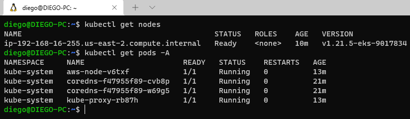
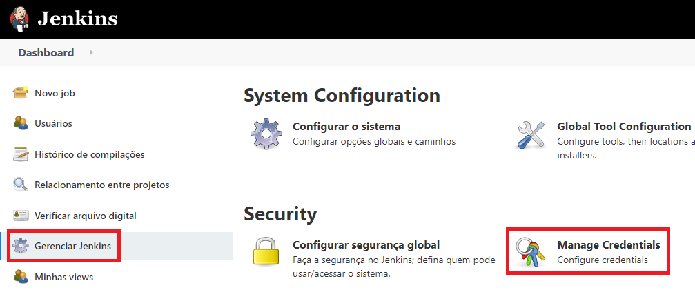
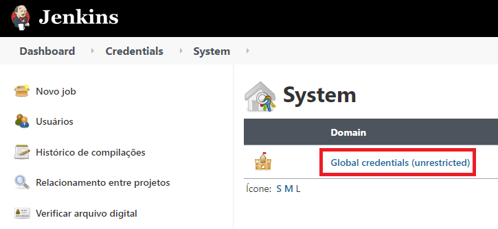
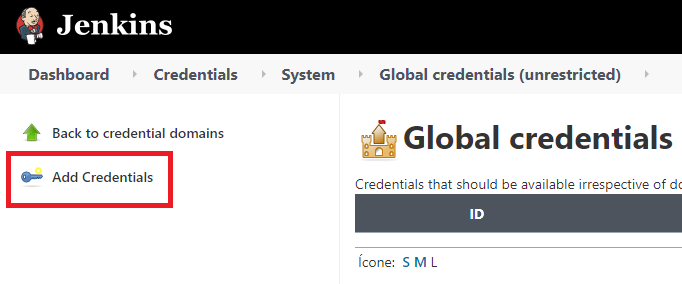
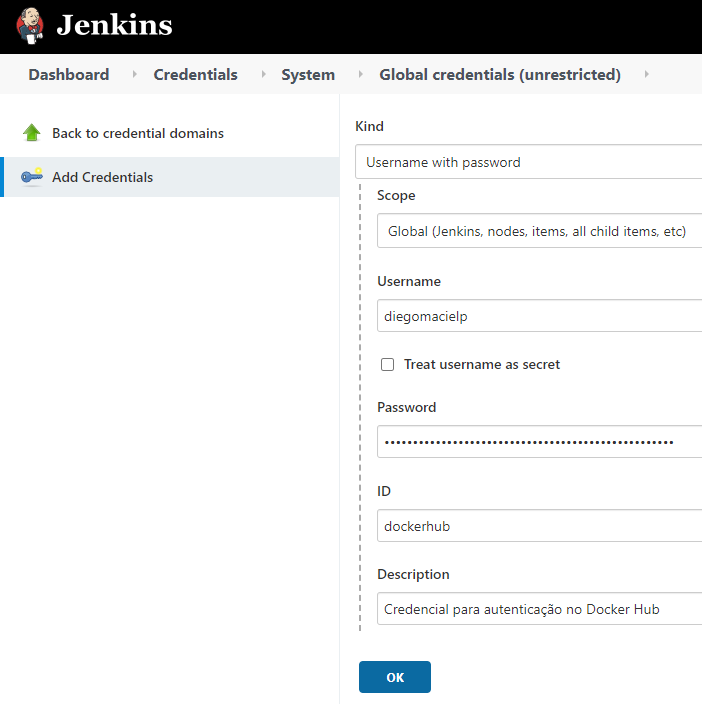
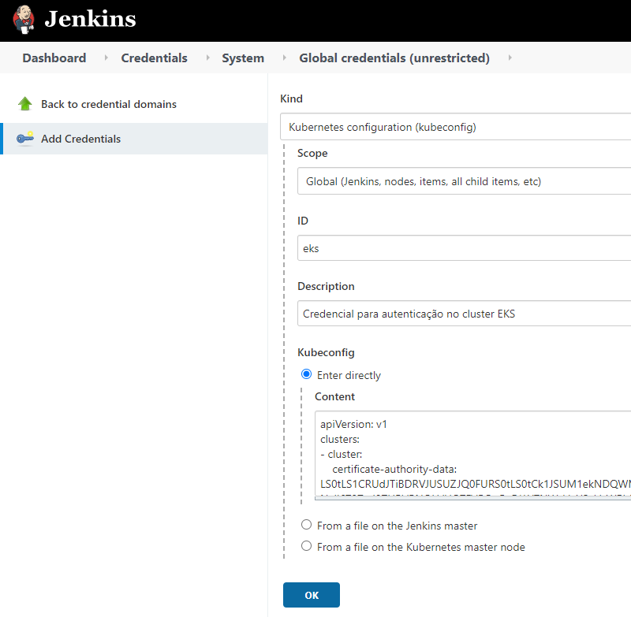

# Jenkins EKS
Usando Jenkins para integração contínua no EKS

## Pré requisitos ##

1.  Crie uma chave de acesso à <a href="https://aws.amazon.com/pt/premiumsupport/knowledge-center/create-access-key/">AWS</a> e dê permissão para o gerenciamento de <a href="https://docs.aws.amazon.com/eks/latest/userguide/getting-started-eksctl.html">Cluster EKS</a>.
2.  Crie um cluster EKS utilizando o <a href="https://eksctl.io/introduction/#installation">eksctl</a>: 
    \# *eksctl create cluster --name test-cicd --region us-east-2 --nodegroup-name group-nodes --node-type t3.small --managed --nodes 1*
    
3.  Instale o serviço do <a href="https://www.jenkins.io/doc/book/installing/">Jenkins</a>: 
    I. Instale os plugins *Docker plugin, Docker Pipeline e Kubernetes Continuous Deploy Plugin*.
4.  Crie uma conta no <a href="https://hub.docker.com/">Docker Hub</a>.
5.  Instale o binário do <a href="https://kubernetes.io/docs/tasks/tools/">kubectl</a>.

## Criando credenciais de acesso ##

Será necessária a criação de duas credenciais no Jenkins, uma para autenticação do Docker Hub e outra para o cluster EKS.

Clique em <i>Gerenciar Jenkins</i> e <i>em Manage Credentials</i>:

Clique em <i>Global credentials</i>:

Clique em <i>Add Credentials</i>:

A primeira credencial criada será para autenticação no Docker Hub, selecione o tipo Username with password e o escopo Global, por fim passe os dados de acesso:

Para a criação da credencial do EKS, o mesmo procedimento será tomado, porém o tipo da credencial será <i>Kubernetes configuration (kubeconfig).</i> Selecione <i>Enter durectly</i> e cole o conteúdo do arquivo <i>~/.kube/config</i> da máquina onde o cluster foi criado.

## Liberando o acesso do Jenkins ao cluster EKS ##

\# *kubectl create clusterrolebinding cluster-system-anonymous --clusterrole=cluster-admin --user=system:anonymous*

